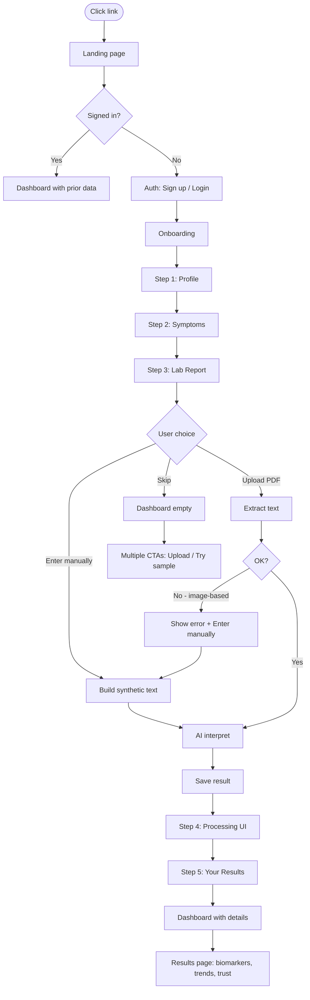

# MedAssist User Pipeline & Flow

This document expands and improves the high-level pipeline: entry points, onboarding, report handling (upload + manual + errors), AI analysis, and dashboard states. It aligns with the live flow and includes all fallbacks and edge cases.

---

## 1. Entry & User State

```
[ User clicks link ]  →  [ Landing page (/)
                               │
                               ├── Signed in?  ──→  [ Top CTA: "Go to Dashboard" ]  →  Dashboard (with prior data)
                               │
                               └── Not signed in  ──→  [ Top CTA: "Sign up" ]  →  Auth (/auth?mode=signup)
```

- **Landing page (/)**  
  - First screen: hero, value props, “Get started free” / “Sign up”.  
  - Trust/disclaimer in footer: educational use only, not a substitute for medical advice.

- **Signed in**  
  - CTA: “Go to Dashboard” → `/dashboard`.  
  - Middleware allows access; dashboard loads profile, biomarkers, lab_results.

- **Not signed in**  
  - CTA: “Sign up” → `/auth?mode=signup`.  
  - “Sign in” (footer or nav) → `/auth?mode=login`.  
  - Legacy `/login` and `/upload` are redirected in middleware to `/auth?mode=login` and `/dashboard` respectively.

---

## 2. Auth & Onboarding Entry

```
[ Auth page (/auth) ]
    │
    ├── Sign up  →  Create account  →  (optional email confirm)  →  [ Onboarding Step 1 ]
    │
    └── Login    →  Sign in  →  Onboarding complete?  →  Yes: Dashboard
                                    │
                                    No: [ Onboarding Step 1 ]
```

- **Sign up:** After account creation, user is sent to **onboarding** (step 1).  
- **Login:** If `onboarding_complete` is false, user is sent to onboarding; otherwise to dashboard.

---

## 3. Onboarding (Multi-Step Form)

Onboarding has **5 steps**. Steps 1–2 are always shown; step 3 is report upload or manual entry or skip; steps 4–5 run only when a report is submitted and processed.

| Step | Name (UI)     | Purpose |
|------|----------------|--------|
| 1    | Your Profile   | Name, age, sex, blood type (basic info). |
| 2    | Symptoms       | “Feeling uneasy?” — select symptoms (used later for AI context). |
| 3    | Lab Report     | **Upload PDF**, **Enter manually**, or **Skip for now**. |
| 4    | AI Analysis    | Processing (OCR → AI → score); or error state with retry / manual entry. |
| 5    | Your Results   | “Dashboard is ready” + save & go to dashboard; or skip path already on dashboard. |

### Step 1 – Basic info

- Collect: name, age, sex, blood type (and any other profile fields).  
- Next → Step 2.

### Step 2 – Symptoms

- “Are you feeling uneasy? What are you feeling?” — multi-select (and optional free text).  
- Back → Step 1. Next → Step 3.

### Step 3 – Report (critical branch)

Three explicit options:

1. **Upload PDF**  
   - Drag-and-drop or file picker.  
   - Validate: type (PDF), size (e.g. ≤10MB).  
   - On submit → go to **Step 4 (Processing)** with file in store.

2. **Enter manually**  
   - Form: add rows (biomarker name, value, unit).  
   - Same “Analyze & save” path as upload: send `manualPayload` to API → AI interpretation → then either show summary and go to Step 5, or go straight to dashboard with new result.  
   - Ensures the app is usable even when PDF is missing or extraction fails.

3. **Skip for now**  
   - Call `completeOnboarding()` (no report saved).  
   - Redirect to **Dashboard (empty state)**.  
   - Dashboard and other surfaces show “Upload your first report” / “Try with sample lab report”.

If the user **uploaded a file** and Step 4 fails (e.g. image-based PDF), show a clear error and offer **“Enter values manually instead”** (or link back to Step 3 with manual tab focused).

---

## 4. Report Handling & Extraction (Step 4 Backend)

When a report is submitted (file or manual), the pipeline is:

```
[ File or Manual payload ]
         │
         ▼
[ Rate limit check ]
         │
         ├── Manual payload?  ──→  [ Build synthetic lab text ]  ──→  [ AI interpretation ]  ──→  [ Save ]  ──→  Success
         │
         └── File  ──→  [ Extraction service ]
                            │
                            ├── Success (text ≥ N chars)  ──→  [ AI interpretation ]  ──→  [ Save ]  ──→  Success
                            │
                            └── Failure (e.g. image-based / OCR failed)
                                    │
                                    └──  Return 400 + code IMAGE_BASED_PDF
                                         UI: “This file appears to be image-based. Please upload a digital lab report or enter values manually.”
                                         Offer: [ Enter values manually ] (or retry with another file)
```

- **Extraction service**  
  - Input: PDF buffer, MIME type.  
  - Uses OCR (e.g. OCR.space). If extracted text is too short or OCR fails in a way that suggests scanned/image PDF → throw `ImageBasedPdfError`.  
  - API catches it and returns a **clean message** and, where applicable, a manual-entry path.

- **Manual entry**  
  - Payload: `{ biomarkers: [ { name, value, unit } ] }`.  
  - Normalize (trim, coerce number, filter invalid rows). Build synthetic text, run same **AI interpretation** and **save** path.  
  - Ensures **100% usability** even when no PDF or when OCR is unreliable.

- **Edge cases**  
  - Large files: reject above size limit (e.g. 10MB) with clear message.  
  - Missing/empty fields: validation and normalization (e.g. optional reference min/max, safe defaults for AI interpretation).  
  - Units: user enters units from their report (e.g. mg/dL or mmol/L); no automatic conversion in pipeline (document in UI if needed).

---

## 5. AI Interpretation & Persistence

- **Input:** Extracted lab text (from OCR or manual).  
- **Optional context:** Symptoms (onboarding), prior biomarker history (for trends).  
- **AI (e.g. Groq):** Extract biomarkers, assign status (optimal / warning / critical), reference ranges, plain-English interpretation, summary, longitudinal insights.  
- **Validation:** Zod (or similar) for structured output; recalculate health score from biomarker statuses.  
- **Persistence:** `save_complete_report` (or equivalent): lab_results + biomarkers in one transaction.  
- **Response:** Same shape for upload and manual so UI can show “Data extracted, wanna see your health score?” and then Step 5 / dashboard.

---

## 6. Step 4 (Processing) UI

- **Progress:** Show stages (e.g. “Scanning report…”, “Identifying biomarkers…”, “Comparing reference ranges…”, “Generating explanations…”, “Calculating health score…”).  
- **Success:** Show health score and short summary → “See full breakdown” → Step 5.  
- **Error:**  
  - **Image-based PDF:** Message as above + “Enter values manually” / “Upload a different file”.  
  - **Rate limit / timeout / validation:** Clear message + “Try again” or “Upload a different file”.  
  - On retry, user can choose another file or switch to manual entry.

---

## 7. Step 5 – “Your Results” & Dashboard Entry

- **With report:** “Your dashboard is ready with your details.” Save result (if not already saved), mark onboarding complete, redirect to **Dashboard**.  
- **Without report (skip path):** User is already on Dashboard (empty).  
- **Dashboard (first time, no data):**  
  - Empty state: “Ready when you are” + **Upload my first report** + **Try with sample lab report** (demo mode).  
  - Multiple CTAs across the app (“Upload report”, “Add lab results”) so users are always one click from adding a report or opening the upload modal.

---

## 8. Dashboard States

| State            | When                         | What user sees |
|------------------|------------------------------|----------------|
| Empty            | No lab results yet           | Hero empty state, “Upload my first report”, “Try with sample lab report”, trust layer (compact). |
| With data        | At least one report saved    | Health score, biomarkers, trend charts, insights, “Upload” to add more. Trust layer (compact). |
| Demo mode        | User clicked “Try with sample lab report” | Same as “With data” but with preloaded sample JSON (no DB write). Can toggle off. |

- **Upload (from dashboard):** Modal with two tabs: **Upload PDF** and **Enter manually**. Same API and error handling as onboarding (image-based message + manual fallback).  
- **Trust layer:** Privacy (no data stored unless you save), AI limitations, “Educational use only” — on dashboard and results (compact) and optionally in onboarding/results (full block).

---

## 9. Results Page & Lab Results View

- **Entry:** From dashboard/sidebar (“Results” / “Lab Results”).  
- **Data:** Fetched by user (biomarkers from DB).  
- **UI:**  
  - Categories / search.  
  - List with status (optimal / monitor / action), **reference range bar** (Low | Normal | High), value vs range.  
  - **Abnormal markers:** Warning/critical highlighted (e.g. left border + background tint).  
  - Detail panel: value, reference range, AI interpretation, trend (if multiple reports).  
- **Actions:** “Upload New Report” → `/dashboard` (upload modal lives there). “Export PDF” (print). “Ask AI” → Assistant.  
- **Trust:** Compact disclaimer (privacy + educational use).

---

## 10. Demo Mode

- **Entry points:**  
  - Landing: (optional) “Try demo” link.  
  - Dashboard empty state: **“Try with sample lab report”** button.  
- **Behavior:** Preload mock lab result + mock history (no save). Dashboard and results show sample data; user can toggle demo off to see real data or empty state.  
- **Purpose:** Let reviewers and professors try the app instantly without uploading real reports.

---

## 11. Trust Layer Placement

- **Landing:** Footer disclaimer (educational only, not diagnosis, consult physician).  
- **Auth:** Optional short line (e.g. “By signing up you agree to Terms & Privacy”).  
- **Dashboard:** Compact (e.g. one line: privacy + educational use).  
- **Results:** Compact same as dashboard; optional full block (privacy + AI limitations + educational use) for first visit or in settings.  
- **After first analysis (Step 4/5):** Optional full trust block so users see limitations before relying on insights.

---

## 12. Architecture (Behind the Flow)

- **Extraction:** Dedicated service (e.g. `extractionService`). PDF → text; throws typed errors (e.g. `ImageBasedPdfError`) for image-based or failed extraction.  
- **AI:** Dedicated service (e.g. `aiAnalysisService`). Text + optional symptoms/history → structured result + health score.  
- **API route (e.g. analyze-report):** Orchestrates rate limit, file vs manual, extraction (if file), AI, save. Returns same response shape for upload and manual.  
- **UI:** Separate components for upload modal, manual form, processing, error states, dashboard, results. No business logic mixed into a single giant file.

---

## 13. Mermaid Overview (Optional)



---

## 14. Summary of Improvements Reflected Here

- **PDF handling:** Image-based detection, clear error message, no silent failure.  
- **Manual entry:** Option on Step 3 and in dashboard modal; same AI + save path.  
- **Trust layer:** Privacy, AI limitations, educational use — landing, dashboard, results.  
- **Intelligent feel:** Reference range bar (Low | Normal | High), abnormal markers highlighted, trends when multiple reports.  
- **Demo mode:** “Try with sample lab report” from empty dashboard (and optionally landing).  
- **Edge cases:** File size, missing/empty fields, optional reference ranges, robust validation.  
- **Routes:** `/login` → `/auth?mode=login`, `/upload` → `/dashboard`; “Upload New Report” on results goes to dashboard.  
- **Architecture:** Extraction service, AI service, thin API route, separated UI components.

This pipeline is the single source of truth for the product flow; implementation should stay aligned with it for consistency and viva/demo clarity.
